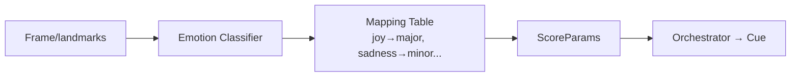

# Disney – AI Dynamic Collaboration (Fantasia Edition)

> “Inspired by Disney’s *Fantasia (1940)*, this project brings advanced AI into orchestration, where **Game Theory** and **Computer Vision** work together to balance creativity between humans and machines.”

---

## 🎼 Must-Code Projects

### 1. 🎭 AI–Composer Negotiation Engine (*Sorcerer’s Apprentice*)
- Implements **multi-agent payoff matrix orchestration**.  
- Uses **Nash bargaining** to find the optimal compromise between:  
  - **Human Composer Preferences** (stylistic keys, simpler density).  
  - **AI Agent Preferences** (continuity, motif complexity).  
- Produces an agreed orchestration (tempo, density, motif, instrumentation).  
- Demonstrates **advanced algorithms/game theory** tied to Stanford coursework.  

### 2. 🧚 Fantasia Rescore Engine (*Dance of the Hours*)
- Real-time **Computer Vision → Orchestration pipeline**.  
- Detects facial expressions + motion cues (e.g., smile → flutes, frown → low strings).  
- Generates **dynamic orchestration changes** in sync with character emotion.  
- Directly tied to **Columbia University Computer Vision specialization**.  
- Adds **visual wow factor** and connects directly to *Fantasia’s* legacy.  

---

## ⚙️ How to Run

```bash
# Run the Game Theory engine
python -m src.game_theory.engine

# Run the CV → Orchestration pipeline
python -m src.render.orchestrator

# Run all tests
pytest -q
```

---

## 🧩 Architecture

### Game Theory Negotiation
```mermaid
flowchart TB
H[Human Agent<br/>stylistic prefs] --> M{Nash Bargaining}
A[AI Agent<br/>continuity & complexity] --> M
M --> P[Agreed Params x*<br/>tempo, key, motif, density]
P --> O[Orchestrator → Cue<br/>(MusicXML/MIDI-ready)]
```

### CV → Orchestration Pipeline


---

## 🛠 Tech Stack
- **Algorithms/Game Theory:** Nash bargaining engine on constrained orchestral grid.  
- **Computer Vision:** Emotion logits mapped to orchestration parameters.  
- **Languages:** Python (expandable to Swift/Kotlin/JS).  
- **Testing:** Pytest for reproducibility + validation.  
- **Outputs:** Orchestration cues (MusicXML/MIDI-ready).  

---

## 🌍 Why This Repo Matters
- **Anchor:** Game Theory → Disney’s identity (*Sorcerer’s Apprentice*).  
- **Bonus:** Fantasia CV → wow factor, Columbia coursework tie-in.  
- **No demos:** Both are advanced builds, showing depth of implementation.  
- **Portfolio value:** Combines algorithms, CV, and orchestration for cross-pillar strength.  

---

## 🚀 Roadmap (advanced, post-v1)
- 🎶 **Motif ML Classifier** → ML trained on 500+ Disney soundtracks (e.g., *When You Wish Upon a Star*).  
- 🌍 **Localization Orchestration Bot (RPA)** → auto-adapts orchestration to 20+ language dubs.  
- 📐 **Adaptive Orchestration Graphs (Algorithms/OOP)** → scene-graph nodes mapped to chord progressions.  

---

## 📌 Carnegie Hall Pillar Mapping
- **Dynamic Collaboration (Game Theory):** ✅ Must-code anchor.  
- **Expressive Nuance (CV):** ✅ Bonus must-code.  
- **Stylistic Authenticity (ML):** Planned (Motif Classifier).  
- **Precision & Scalability (RPA):** Planned (Localization Bot).  
- **Mathematical Depth (Algorithms/OOP):** Planned (Chord Graphs).  

---

## 🔑 Summary
This repo proves **advanced orchestration coding**, not demos:
- One **anchor project** (Game Theory).  
- One **bonus advanced project** (Fantasia CV).  
- Three **roadmap projects** documented, for portfolio breadth.  

Together, they make Disney the **showcase repo** in the 10 mirrors ecosystem.
