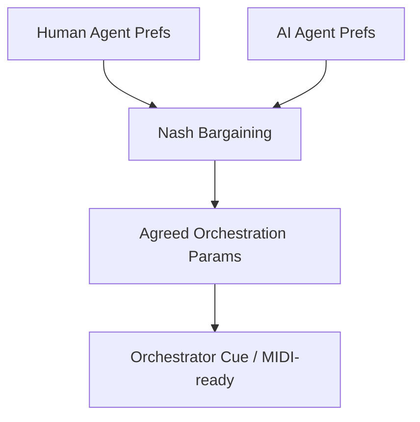
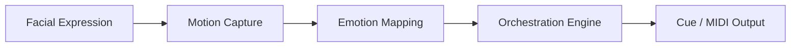

# Disney – AI Dynamic Collaboration (Fantasia Edition)

*Inspired by Disney’s *Fantasia (1940)*, this project brings advanced AI into orchestration, where Game Theory and Computer Vision work together to balance creativity between humans and machines.*

---

## 🎼 Must-Code Projects

### 1) 🎭 AI–Composer Negotiation Engine (*Sorcerer’s Apprentice*)
- Implements **multi-agent payoff matrix orchestration**.
- **Nash bargaining** balances:
  - 🎹 Human Composer Preferences (stylistic keys, simpler density).
  - 🤖 AI Agent Preferences (continuity, motif complexity).
- Produces agreed orchestration params (tempo, key, motif, density) and a cue.
- Demonstrates **advanced algorithms/game theory** tied to Stanford coursework.
- ✅ Disney anchor identity.



---

### 2) 🧚 Fantasia Rescore Engine (*Dance of the Hours*)
- **Computer Vision → Orchestration pipeline** (expressions + motion → orchestral changes).
- Real-time mapping: 🙂 smile → 🎶 flutes · 😐 frown → 🎻 low strings · 😨 fear → 🎺 dissonant brass.
- Generates **dynamic orchestration changes** in sync with character emotion.
- Direct tie-in to **Columbia University Computer Vision specialization**.
- Adds **visual wow factor** and connects directly to *Fantasia’s* legacy.



---

## ⚙️ How to Run

```bash
# Run the Game Theory engine
python -m src.game_theory.engine

# Run the CV → Orchestration pipeline
python -m src.render.orchestrator

# Run all tests
pytest -q
```

---

## 🛠 Tech

- **Algorithms/Game Theory**: Nash bargaining engine on orchestral grid.  
- **Computer Vision**: Expression logits → orchestration params.  
- **Languages**: Python (expandable to Kotlin/JS).  
- **Testing**: Pytest for reproducibility.  
- **Output**: Orchestration cues (MusicXML/MIDI-ready).  

---

## 🌟 Why This Repo Matters

- **Anchor**: Game Theory → Disney’s identity (*Sorcerer’s Apprentice*).  
- **Bonus**: Fantasia CV → wow factor, Columbia coursework tie-in.  
- ❌ No demos: Both are advanced builds, showing depth of implementation.  
- **Portfolio value**: Combines algorithms, CV, and orchestration for cross-pillar strength.  

---

## 🚀 Roadmap (advanced, post-v1)
- 🎶 ML Motif Classifier → ML trained on 500+ Disney soundtracks.  
- 🌍 Localization Orchestration Bot (RPA) → auto-adapts orchestration for 20+ language dubs.  
- 📊 Adaptive Orchestration Graphs (Algorithms/OOP) → scene graphs mapped to chord progressions.  

---

## 🏛 Carnegie Hall Pillar Mapping
- **Dynamic Collaboration (Game Theory)**: ✅ Must-code anchor.  
- **Expressive Nuance (CV)**: ✅ Bonus must-code.  
- **Stylistic Authenticity (ML)**: Planned (Motif Classifier).  
- **Precision & Scalability (RPA)**: Planned (Localization Bot).  
- **Mathematical Depth (Algorithms/OOP)**: Planned (Chord Graphs).  

---

## 📖 Summary

This repo proves **advanced orchestration coding**, not demos:  
- One anchor project (Game Theory).  
- One bonus advanced project (Fantasia CV).  
- Three roadmap projects documented, for portfolio breadth.  

Together, they make Disney the **showcase repo** in the 10 mirrors ecosystem.  
