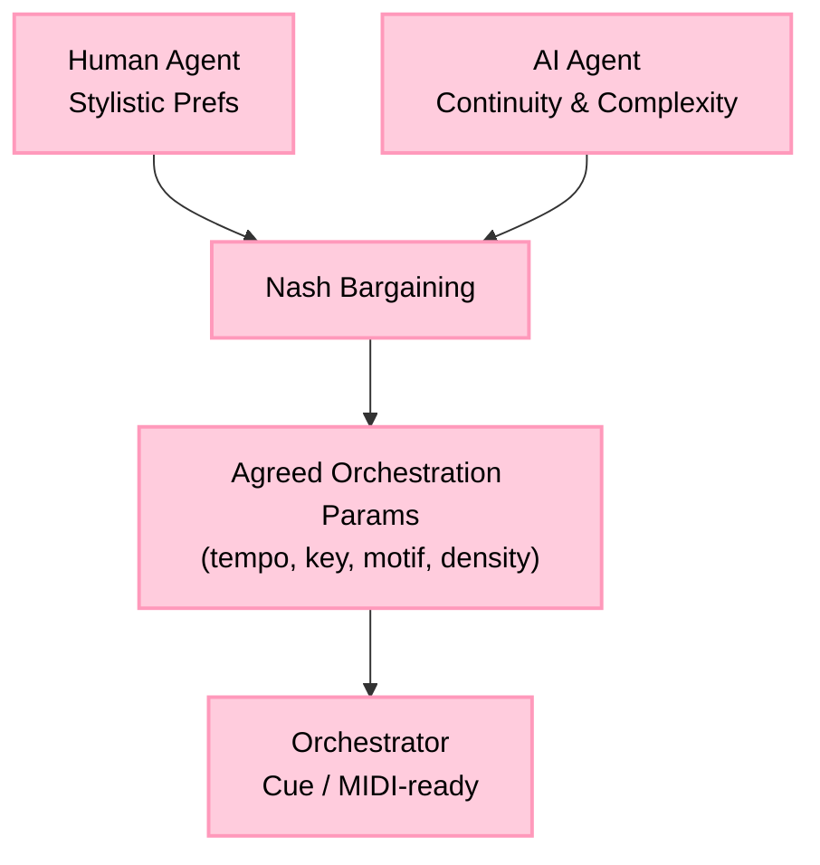
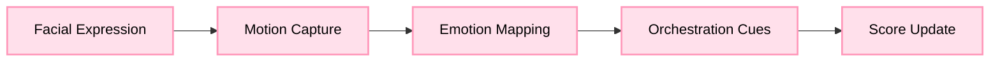

# Disney – AI Dynamic Collaboration (Fantasia Edition)

*Inspired by Disney’s **Fantasia (1940)**, this project brings advanced AI into orchestration, where **Game Theory** and **Computer Vision** work together to balance creativity between humans and machines.*

---

## 🎼 Must-Code Projects

### 1) 🎭 AI–Composer Negotiation Engine (*Sorcerer’s Apprentice*)
- Multi-agent payoff matrix orchestration.
- **Nash bargaining** balances: Human stylistic prefs ↔ AI continuity/complexity.
- Produces agreed orchestration params (tempo, key, motif, density) and a cue.



---

### 2) 🧚 Fantasia Rescore Engine (*Dance of the Hours*)
- **Computer Vision → Orchestration** pipeline (expressions + motion → orchestral changes).
- Real-time mapping: 😀 smile → flutes · 😟 frown → low strings · 😨 fear → dissonant brass.
- Direct tie-in to **Columbia CV** coursework.



---

## ⚙️ How to Run
```bash
python -m src.game_theory.engine       # Nash bargaining → best params
python -m src.render.orchestrator      # CV emotion → orchestration
pytest -q                               # tests
```

## 🏗 Tech
- **Algorithms/Game Theory:** Nash bargaining over a musically constrained grid.  
- **Computer Vision:** emotion logits → orchestration parameters (mapping table).  
- **Testing:** pytest.  
- **Output:** Cue objects (MusicXML/MIDI-ready downstream).

## 📌 Roadmap
- 🎶 Motif ML Classifier · 🌍 RPA Localization Bot · 📐 Scene→Chord Graphs
