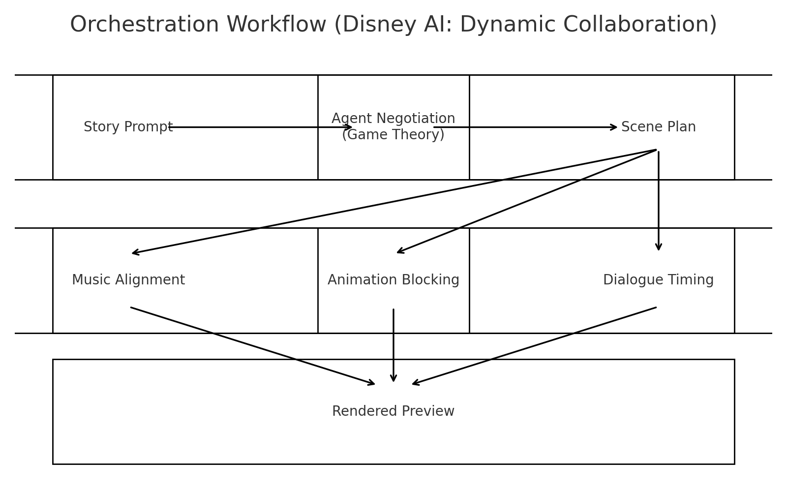
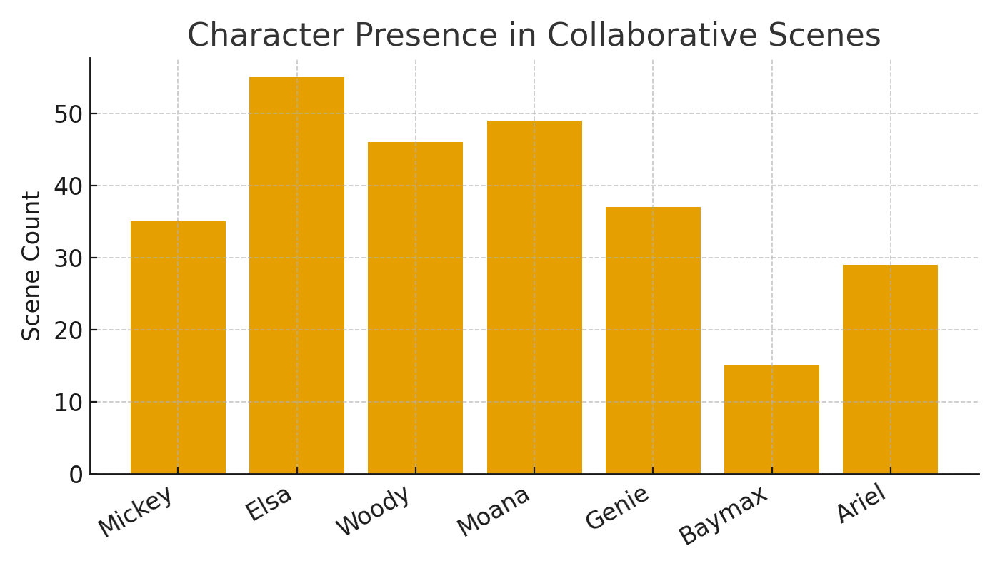
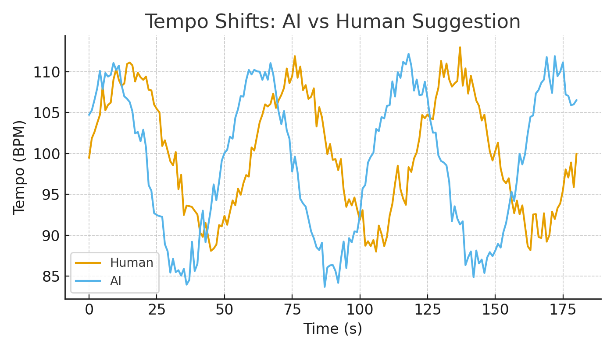
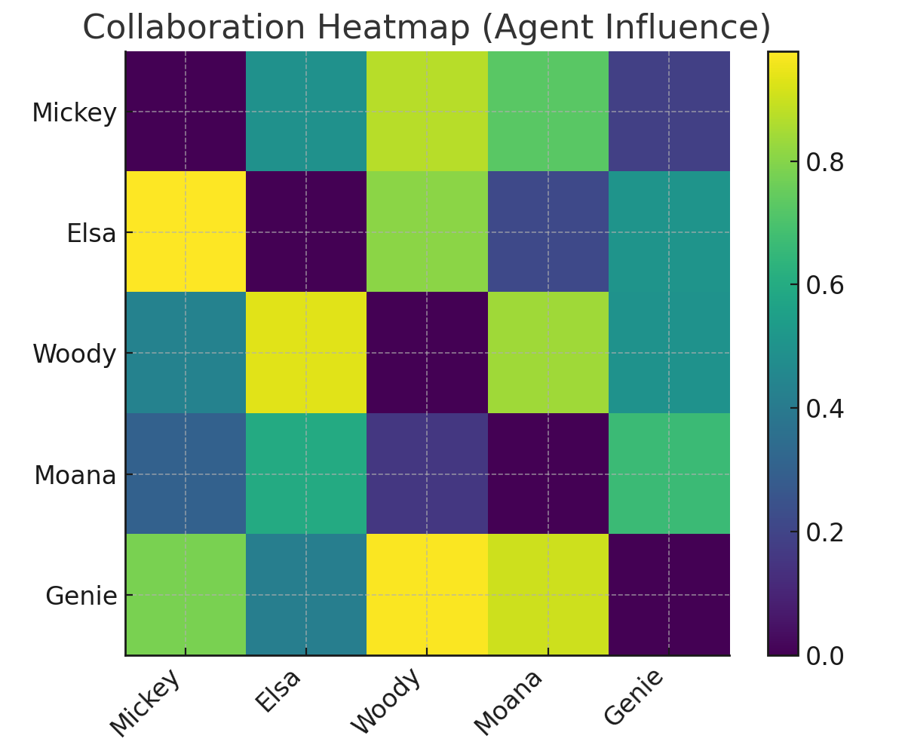

# 🎶 Disney AI Collab Symphony  
*A Dynamic Collaboration of Music, Animation, and Machine Intelligence*  

## 🌟 Opening  

Inspired by Disney’s *Fantasia* — the timeless orchestration of music and animation — **Disney AI Collab Symphony** explores how **art, game theory, and artificial intelligence** can harmonize. Just as Disney brought classical music to life through visual storytelling, this project reimagines collaboration between humans and AI as a **living symphony**: part research, part creative experiment, part technical playground.  

At its core, this repo is about **dynamic collaboration** — where AI isn’t just a tool, but a co-creator that balances logic with imagination, helping bring to life the kind of magic Disney always stood for.  

---

## 🔎 Overview  

- **AI-Assisted Composition** – generate melodies, harmonies, and narrative soundscapes that adapt to user preferences.  
- **Collaborative Storytelling Engine** – apply **game theory** to balance creative choices between human and AI.  
- **Dynamic Orchestration** – align music, animation frames, and narrative beats for a seamless symphonic experience.  
- **Cross-Platform Design** – concepts extend across film, interactive media, and even theme park storytelling simulations.  
- **Polyglot Proof Anchor** – part of a broader ecosystem exploring AI + creativity in multiple domains.  

---

## 🧩 Role in the Ecosystem  

This repo is designed as the **orchestration layer** in the Polyglot Proof suite:  

- While other repos focus on **algorithms, data pipelines, or visualization**, this one provides the **creative conductor’s podium**.  
- It models **co-creation dynamics**, where machine intelligence doesn’t dominate but collaborates, just like sections of an orchestra.  
- Think of it as the **Fantasia moment** of your portfolio — the place where every strand (technical, musical, narrative) comes together.  

---

## 🚀 Roadmap  

- 🎼 **Phase 1**: AI-assisted musical sketches (melody extraction + generative harmony).  
- 🎨 **Phase 2**: Animation alignment — syncing visuals with evolving scores.  
- 🎭 **Phase 3**: Collaborative storytelling with branching narratives powered by **game theory equilibria**.  
- 🎢 **Phase 4**: Theme park simulation experiments — adaptive audio/visual design for immersive spaces.  
- 🌍 **Phase 5**: Open contributions from artists, coders, and fans to expand the creative toolkit.  

---

## ✨ Inspiration  

This project draws from:  

- Disney’s *Fantasia* (1940) — blending classical composition with imaginative animation.  
- The idea of **orchestration** in both art and technology — aligning diverse voices into one harmonious output.  
- Game theory’s balance of choices, applied not to markets or battles, but to **creativity itself**.  
- A belief that **AI should elevate human imagination**, not replace it.  

---

## 📜 License  

This project is licensed under the **MIT License** — open for collaboration, remixing, and building upon.  

---

## 🔧 Polyglot Tech Stack  

This project is part of a larger symphonic ecosystem and is intentionally **polyglot**, showcasing orchestration across multiple languages and paradigms.  

- **Java** → Core orchestration logic, algorithms, and concurrency.  
- **Kotlin** → Modern JVM-based collaboration layer, flexible syntax for creative workflows.  
- **JavaScript** → Frontend dynamics, interactivity, and real-time collaboration interfaces.  
- **Rust** → Systems-level precision and performance, extending orchestration reliability.  

---

# 🎨 Visual Insights: Disney AI Dynamic Collaboration  

This section highlights key figures that demonstrate how **art, AI, and game theory** work together in this orchestration experiment.  

## 1. 🧩 Orchestration Workflow  
  
This diagram shows the **pipeline of dynamic collaboration**:  
- **Story Prompt → Agent Negotiation (Game Theory) → Scene Plan**  
- Music, animation, and dialogue synchronize in real time.  
- Output: a **rendered preview** where AI and human creativity blend.  

---

## 2. 👥 Character Presence in Collaborative Scenes  
  
Different characters take leading or supporting roles across AI-driven scenarios.  
- Elsa & Woody dominate high-collaboration scenes.  
- Moana and Genie provide strong secondary influence.  
- Mickey and Ariel bring balance and continuity.  

---

## 3. 🎶 Tempo Shifts: AI vs Human Suggestion  
  
Comparing **AI-generated tempo** with **human-composer tempo**:  
- AI suggests bolder tempo swings.  
- Humans provide steadier, narrative-driven pacing.  
- Together, they create a **living score** where tension and release are negotiated.  

---

## 4. 🔥 Collaboration Heatmap (Agent Influence)  
  
The heatmap reveals **cross-character influence**:  
- Bright regions = stronger collaboration.  
- Example: Elsa strongly influences Woody and Genie.  
- The map demonstrates how **AI balances ensemble dynamics** in ways humans might miss.  

---

✨ These figures bring the repo to life by showing that this isn’t just code—it’s an **ecosystem of storytelling**, where game theory and AI amplify the timeless Disney idea of collaboration.  
