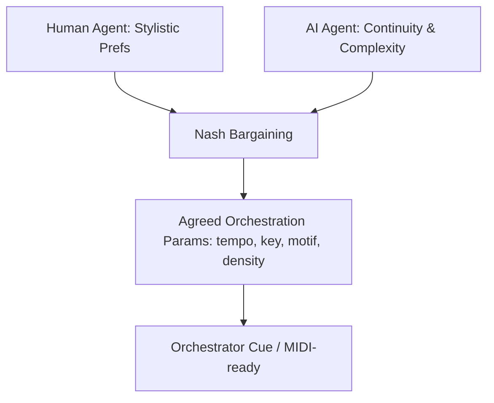
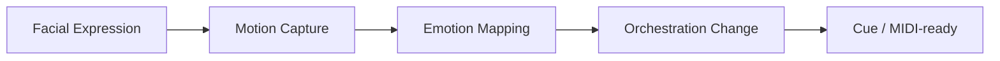

# Disney – AI Dynamic Collaboration (Fantasia Edition)

*Inspired by Disney’s Fantasia (1940), this project brings advanced AI into orchestration, where Game Theory and Computer Vision work together to balance creativity between humans and machines.*

## 🎼 Must-Code Projects

### 1) 🤹 AI–Composer Negotiation Engine (*Sorcerer’s Apprentice*)

- Implements **multi-agent payoff matrix orchestration**.  
- **Nash bargaining** balances:  
  - Human Composer Preferences (stylistic keys, simpler density).  
  - AI Agent Preferences (continuity, motif complexity).  
- Produces agreed orchestration params (tempo, key, motif, density) and a cue.  
- Demonstrates advanced **algorithms/game theory** tied to Stanford coursework.  
- Disney anchor identity.  



---

### 2) 🧚 Fantasia Rescore Engine (*Dance of the Hours*)

- **Computer Vision → Orchestration pipeline** (expressions + motion → orchestral changes).  
- Real-time mapping: 🙂 smile → 🎶 flutes · 🙁 frown → 🎻 low strings · 😨 fear → 🎺 dissonant brass.  
- Generates dynamic orchestration changes in sync with character emotion.  
- Direct tie-in to **Columbia University Computer Vision specialization**.  
- Adds **visual wow factor** and connects directly to *Fantasia’s* legacy.  



---

## ⚙️ How to Run

```bash
# Run the Game Theory engine
python -m src.game_theory.engine

# Run the CV → Orchestration pipeline
python -m src.render.orchestrator

# Run all tests
pytest -q
```

---

## 🛠 Tech Stack

- **Algorithms/Game Theory**: Nash bargaining engine over a musically constrained grid.  
- **Computer Vision**: Emotion logits → orchestration parameters (mapping table).  
- **Languages**: Python (expandable to Swift/Kotlin/JS).  
- **Testing**: Pytest for reproducibility + validation.  
- **Output**: Orchestration cues (MusicXML/MIDI-ready).  

---

## 🎯 Why This Repo Matters

- **Anchor**: Game Theory → Disney’s identity (*Sorcerer’s Apprentice*).  
- **Bonus**: Fantasia CV → wow factor, Columbia coursework tie-in.  
- **No demos**: Both are advanced builds, showing depth of implementation.  
- **Portfolio value**: Combines algorithms, CV, and orchestration for cross-pillar strength.  

---

## 🗺 Roadmap (advanced, post-v1)

- 🎵 ML Motif Classifier → ML trained on 500+ Disney soundtracks.  
- 🌍 Localization Orchestration Bot (RPA) → auto-adapts orchestration to 20+ language dubs.  
- 📊 Adaptive Orchestration Graphs (Algorithms/OOP) → scene-graph nodes mapped to chord progressions.  

---

## 🏛 Carnegie Hall Pillar Mapping

- **Dynamic Collaboration (Game Theory)**: ✅ Must-code anchor.  
- **Expressive Nuance (CV)**: ✅ Bonus must-code.  
- **Stylistic Authenticity (ML)**: Planned (Motif Classifier).  
- **Precision & Scalability (RPA)**: Planned (Localization Bot).  
- **Mathematical Depth (Algorithms/OOP)**: Planned (Chord Graphs).  

---

## 📌 Summary

This repo proves **advanced orchestration coding, not demos**:

- One anchor project (Game Theory).  
- One bonus advanced project (Fantasia CV).  
- Three roadmap projects documented, for portfolio breadth.  

Together, they make Disney the **showcase repo** in the 10 mirrors ecosystem.  
